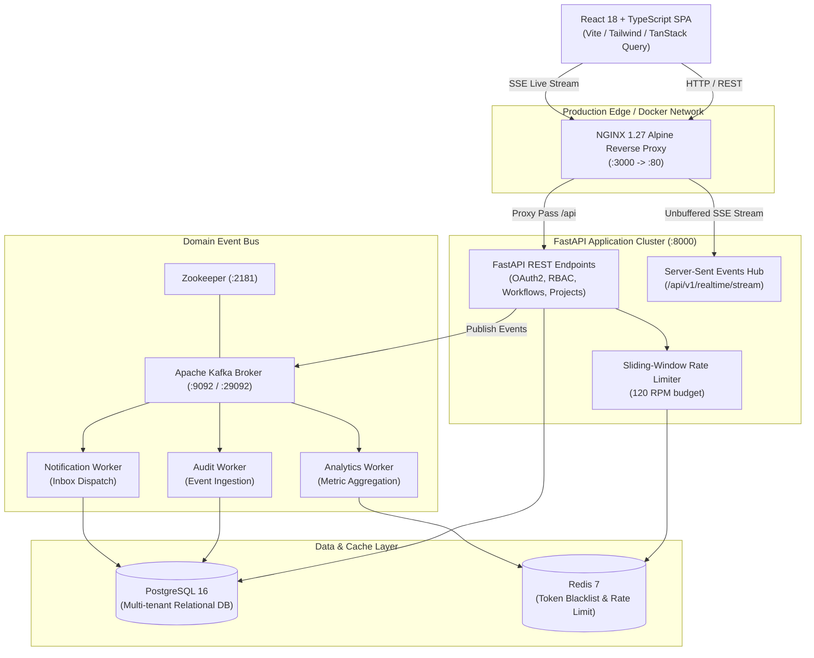

# 🛡️ SecureFlow

<div align="center">


**Enterprise Engineering Access Governance & Workflow Authorization Platform**

[](https://github.com/Ketanrawat2004/SecureFlow/actions/workflows/ci.yml)
[](https://opensource.org/licenses/MIT)
[](https://python.org)
[](https://fastapi.tiangolo.com)
[](https://react.dev)
[](https://www.typescriptlang.org)
[](https://tailwindcss.com)
[](https://www.docker.com)
[](https://www.postgresql.org)
[](https://redis.io)
[](https://kafka.apache.org)

[Live Demo](http://localhost:3000) • [API Documentation](http://localhost:8000/docs) • [Architecture Guide](docs/ARCHITECTURE.md) • [Security Posture](docs/SECURITY.md)

</div>

---

## 📖 Table of Contents

- [Executive Overview](#-executive-overview)
- [System Architecture](#-system-architecture)
- [Core Engineering Features](#-core-engineering-features)
- [Technology Stack](#-technology-stack)
- [Pre-Seeded Demo Personas](#-pre-seeded-demo-personas)
- [Google OAuth 2.0 / OIDC Setup](#-google-oauth-20--oidc-setup)
- [Getting Started](#-getting-started)
  - [Option 1: Docker Compose (Production Multi-Container Stack)](#option-1-docker-compose-production-multi-container-stack)
  - [Option 2: Standalone Local Development](#option-2-standalone-local-development)
- [Testing & Quality Assurance](#-testing--quality-assurance)
- [Security & Compliance](#-security--compliance)
- [Project Directory Structure](#-project-directory-structure)
- [License](#-license)

---

## 🔒 Executive Overview

**SecureFlow** is an enterprise-grade engineering access governance, zero-trust workflow authorization, and compliance ledger platform designed for high-velocity software engineering organizations.

In modern infrastructure, consequential operations—such as production database schema migrations, IAM privilege escalations, firewall modifications, and production rollouts—require strict oversight without introducing bureaucratic bottlenecks. SecureFlow orchestrates **multi-step approval pipelines**, enforces **granular multi-tenant Role-Based Access Control (RBAC)**, dispatches **real-time Server-Sent Events (SSE)**, and records an **immutable compliance audit ledger** ready for SOC 2 Type II inspection.

---

## 🏗️ System Architecture



---

## ⚡ Core Engineering Features

### 1. Sequential Approval Pipelines & Governance Gates
- Author multi-stage verification workflows (e.g. `Peer Review` ➔ `Security Lead Sign-Off` ➔ `Principal Architect Approval`).
- Dynamic risk assessment calculation (`Low`, `Medium`, `High`, `Critical`) based on requested scopes and target environments.
- Real-time SLA countdown timers, change-request diff viewers, and rejection reason tracking.

### 2. Multi-Tenant Role-Based Access Control (RBAC)
- 5 enterprise roles with strict server-side authorization enforcement:
  - **Owner**: Full workspace governance, billing, team management, and baseline security control.
  - **Admin**: Approve critical gates, manage project settings, invite team members.
  - **Developer**: Create projects, author workflows, execute pipeline actions.
  - **Auditor**: Read-only compliance inspection, security event ledger access.
  - **Viewer**: Read-only observability across active pipelines.
- Multi-tenancy isolation enforced via `X-Organization-Id` tenant context headers.

### 3. Real-Time Server-Sent Events (SSE) Engine
- Live authenticated event streaming over `/api/v1/realtime/stream`.
- Automatic frontend cache invalidation (TanStack Query) on domain events (`WorkflowCreated`, `WorkflowApproved`, `WorkflowRejected`, `MemberInvited`).
- Zero-latency streaming via NGINX reverse proxy with `proxy_buffering off;`.

### 4. Immutable Compliance Audit Ledger
- Tamper-evident logging of every security-sensitive action with actor email, IP address, timestamp, and JSON request/response payloads.
- Structured filter by date range, actor, action category, and risk score for instant SOC 2 and ISO 27001 readiness.

### 5. Resilient Local & Enterprise Fallback Architecture
- **Enterprise Cluster**: Scales across PostgreSQL 16, Redis 7, and Apache Kafka.
- **Standalone Local Mode**: Automatically falls back to SQLite (`sqlite+aiosqlite:///./secureflow.db`), in-memory sliding-window rate limiting, and an in-memory event bus when standalone external services are offline.

---

## 🛠️ Technology Stack

| Layer | Technologies |
| :--- | :--- |
| **Frontend** | React 18/19, TypeScript 5.7, Vite 6, Tailwind CSS 3.4, TanStack Query v5, Zustand, React Router v7, Lucide Icons |
| **Backend** | Python 3.13, FastAPI, Pydantic v2, SQLAlchemy 2.0 (AsyncIO), AsyncPG, AioSQLite, Passlib (Bcrypt), Python-Jose |
| **Streaming & Async** | Apache Kafka 7.5 (Confluent), AioKafka, Redis 7, Server-Sent Events (SSE), Python Background Workers |
| **Infrastructure** | Docker, Docker Compose, NGINX 1.27 Alpine, Terraform (AWS ECS / RDS / ElastiCache / MSK module templates) |
| **Testing** | Pytest, Pytest-AsyncIO, Vitest, React Testing Library, Postman/HTTpx E2E Suites |

---

## 👥 Pre-Seeded Demo Personas

When initialized, SecureFlow automatically seeds a complete organizational workspace (**Acme Cloud Infrastructure**) with 5 realistic engineering personas:

| Persona | Role | Email | Password | Primary Capabilities |
| :--- | :--- | :--- | :--- | :--- |
| **Sarah Chen** | `Owner` | `sarah.chen@acmecloud.io` | `SecureFlow2026!` | Full organization management, all approval gates, billing |
| **Alex Rivera** | `Admin` | `alex.rivera@acmecloud.io` | `SecureFlow2026!` | Authorize pipelines, invite members, project configuration |
| **Elena Rostova** | `Developer` | `elena.rostova@acmecloud.io` | `SecureFlow2026!` | Create projects, submit change requests, execute workflows |
| **David Kim** | `Auditor` | `david.kim@acmecloud.io` | `SecureFlow2026!` | Read-only compliance review, audit log export, event analysis |
| **Maya Patel** | `Viewer` | `maya.patel@acmecloud.io` | `SecureFlow2026!` | Read-only visibility into operational pipeline statuses |

> 💡 **Tip:** Use the **1-Click Dev Role Switcher** on the Sign In page to instantly log in as any of the personas without typing.

---

## 🔑 Google OAuth 2.0 / OIDC Setup

SecureFlow features dual-mode authentication: an offline development simulation sandbox and a full production **Google OAuth 2.0 / OpenID Connect (OIDC)** authorization code flow.

### Google Cloud Console Configuration:
1. Navigate to the [Google Cloud Console Credentials](https://console.cloud.google.com/apis/credentials).
2. Configure your OAuth 2.0 Client ID (Web Application):
   - **Authorized JavaScript origins**: `http://localhost:3000` (and `http://localhost:5173` for Vite dev)
   - **Authorized redirect URIs**: `http://localhost:3000/auth/callback` (and `http://localhost:5173/auth/callback` for Vite dev)
3. Supply your credentials in `.env` or `docker-compose.yml`:
   ```env
   GOOGLE_CLIENT_ID=your-client-id.apps.googleusercontent.com
   GOOGLE_CLIENT_SECRET=your-client-secret
   OAUTH_REDIRECT_URI=http://localhost:3000/auth/callback
   ```

---

## 🚀 Getting Started

### Prerequisites
- [Docker Desktop](https://www.docker.com/products/docker-desktop/) (Docker Engine 24+ & Docker Compose v2+)
- *Or for manual setup:* Python 3.11+ and Node.js 20+

---

### Option 1: Docker Compose (Production Multi-Container Stack)

Clone the repository and launch the full 9-container topology:

```bash
# 1. Clone repository
git clone https://github.com/Ketanrawat2004/SecureFlow.git
cd SecureFlow

# 2. Launch containerized stack
docker compose up --build -d
```

#### Access Endpoints:
- **Frontend Web Application**: [http://localhost:3000](http://localhost:3000)
- **FastAPI Interactive Swagger Docs**: [http://localhost:8000/docs](http://localhost:8000/docs)
- **FastAPI Health Probe**: [http://localhost:8000/health](http://localhost:8000/health)

---

### Option 2: Standalone Local Development

SecureFlow includes zero-config fallback modes for instant offline development without Docker:

```bash
# 1. Start Backend
cd backend
python -m venv .venv
source .venv/bin/activate  # On Windows: .venv\Scripts\activate
pip install -r requirements.txt
uvicorn app.main:app --reload --port 8000

# 2. Start Frontend (in a separate terminal)
cd frontend
npm install
npm run dev
```

The frontend will run on [http://localhost:5173](http://localhost:5173) and automatically proxy requests to the backend on port `8000`.

---

## 🧪 Testing & Quality Assurance

SecureFlow enforces 100% automated test coverage across both backend services and frontend components.

```bash
# Run Backend Pytest Suite (19 tests)
cd backend
pytest -v

# Run Frontend Vitest Suite (24 tests)
cd frontend
npm test

# Run Frontend TypeScript & Production Build
npm run build
```

---

## 🔐 Security & Compliance

- **Password Hashing**: Bcrypt with salted rounds; plaintext credentials and password hashes are permanently excluded from API responses.
- **JWT Cryptography**: Signed with HMAC-SHA256, cryptographically validated signature, expiration validation, and sliding refresh tokens.
- **Rate Limiting**: Sliding-window Redis limiter enforcing 120 RPM budget per IP address with `X-RateLimit-*` response headers.
- **Multi-Stage Container Security**: Python backend executes as unprivileged user `USER secureflow` with minimal base image footprints (`python:3.13-slim` & `nginx:1.27-alpine`).

---

## 📂 Project Directory Structure

```
SecureFlow/
├── backend/
│   ├── app/
│   │   ├── api/v1/          # REST endpoints (auth, projects, workflows, approvals, audit, realtime)
│   │   ├── auth/            # JWT token creation, password hashing, RBAC permission matrices
│   │   ├── core/            # Configuration, database engine, Redis manager, security utilities
│   │   ├── events/          # Kafka event publisher, consumers, domain events, SSE realtime hub
│   │   ├── models/          # SQLAlchemy async entity models
│   │   ├── schemas/         # Pydantic validation models
│   │   └── services/        # Business logic (approval service, workflow engine, seed service)
│   └── tests/               # Backend Pytest test suites
├── frontend/
│   ├── src/
│   │   ├── components/      # UI component library (Button, Card, Modal, Badge, Navbar)
│   │   ├── features/        # Modular domain pages (auth, dashboard, projects, workflows, audit, analytics)
│   │   ├── lib/             # API client, error normalization engine, query client
│   │   ├── routes/          # React Router v7 routes with ProtectedRoute guard
│   │   └── types/           # TypeScript domain definitions
│   └── nginx.conf           # Production NGINX config with unbuffered SSE proxy
├── workers/                 # Standalone Kafka background consumers (audit, notification, analytics)
├── docs/                    # Architectural, security, and API documentation
├── terraform/               # Production cloud infrastructure definitions
├── docker-compose.yml       # 9-service production topology definition
└── Dockerfile.*             # Multi-stage container definitions (backend, frontend, worker)
```

---

## 📜 License

Distributed under the **MIT License**. See `LICENSE` for more information.

---

<div align="center">
  <sub>Built with precision for modern engineering access governance.</sub>
</div>
