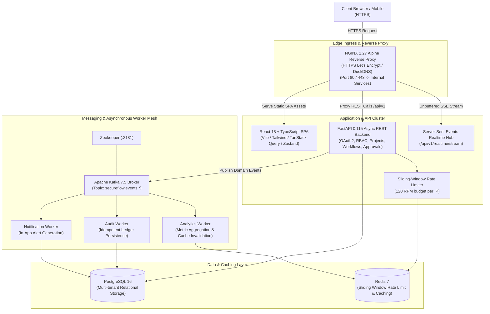

# 🛡️ SecureFlow

<div align="center">


**Enterprise Access Governance, Multi-Stage Workflow Authorization & Compliance Audit Platform**

### 🚀 Live Production Deployment
### 👉 [https://secureflow.duckdns.org](https://secureflow.duckdns.org) 👈

[](https://secureflow.duckdns.org)
[](https://secureflow.duckdns.org)
[](https://github.com/Ketanrawat2004/SecureFlow/actions/workflows/ci.yml)
[](https://opensource.org/licenses/MIT)

<br/>

[](https://python.org)
[](https://fastapi.tiangolo.com)
[](https://react.dev)
[](https://www.typescriptlang.org)
[](https://tailwindcss.com)
[](https://www.postgresql.org)
[](https://redis.io)
[](https://kafka.apache.org)
[](https://www.docker.com)

<br/>

🌐 **[Open Live Website](https://secureflow.duckdns.org)** • 📖 **[Architecture Guide](docs/ARCHITECTURE.md)** • 📑 **[API Reference](docs/API_REFERENCE.md)** • 🔐 **[Security Posture](docs/SECURITY.md)**

</div>

---

> [!TIP]
> **Live Production Website**: SecureFlow is fully deployed and active at **[https://secureflow.duckdns.org](https://secureflow.duckdns.org)** with HTTPS (Let's Encrypt SSL), Google SSO authentication, real-time Server-Sent Events, and interactive 1-Click RBAC Role Switchers.

---

## 📖 Table of Contents

- [🌐 Live Production Website](#-live-production-website)
- [Executive Overview](#-executive-overview)
- [System Architecture](#-system-architecture)
- [Key Features](#-key-features)
- [Technology Stack](#-technology-stack)
- [Pre-Seeded Demo Personas](#-pre-seeded-demo-personas)
- [Google OAuth 2.0 & SSO Configuration](#-google-oauth-20--sso-configuration)
- [Getting Started & Deployment](#-getting-started--deployment)
  - [Option 1: Production Cloud Deployment (DuckDNS + Nginx + HTTPS)](#option-1-production-cloud-deployment-duckdns--nginx--https)
  - [Option 2: Docker Compose (Local Multi-Container Stack)](#option-2-docker-compose-local-multi-container-stack)
  - [Option 3: Standalone Local Development (Offline Sandbox)](#option-3-standalone-local-development-offline-sandbox)
- [Testing & Quality Assurance](#-testing--quality-assurance)
- [Security & Compliance Posture](#-security--compliance-posture)
- [Project Directory Structure](#-project-directory-structure)
- [API Reference Summary](#-api-reference-summary)
- [License](#-license)

---

## 🌐 Live Production Website

SecureFlow is deployed in production and publicly accessible:

| Attribute | Details |
| :--- | :--- |
| **Production URL** | **[https://secureflow.duckdns.org](https://secureflow.duckdns.org)** |
| **Security / SSL** | Automated Let's Encrypt TLS/HTTPS Certificate with Auto-Renewal |
| **Authentication** | Google OAuth 2.0 / OpenID Connect SSO + Password + 1-Click Dev Switcher |
| **OAuth Callback URI** | `https://secureflow.duckdns.org/auth/callback` |
| **Edge Ingress** | NGINX 1.27 Alpine Reverse Proxy with HTTP/2 and unbuffered SSE |
| **Backend API Health Probe** | `https://secureflow.duckdns.org/api/v1/health` (HTTP 200) |

### ⚡ Quick Live Demo Steps
1. Navigate to **[https://secureflow.duckdns.org](https://secureflow.duckdns.org)** in any modern browser.
2. Click **Sign In** to open the authentication portal.
3. Authenticate using either:
   - **Google SSO**: Click **Continue with Google** for instant OpenID Connect login.
   - **1-Click Dev Role Switcher**: Click on any of the demo persona cards (**Owner**, **Admin**, **Developer**, **Auditor**, **Viewer**) to test distinct RBAC access levels instantly.
4. Experience real-time approval pipelines, workflow governance, live SSE event streams, operational KPI analytics, and compliance audit logs.

---

## 🔒 Executive Overview

**SecureFlow** is an enterprise-grade engineering access governance, zero-trust workflow authorization, and compliance audit platform designed for high-velocity software engineering organizations.

### The Problem It Addresses
In modern cloud and engineering environments, consequential operations—such as production database migrations, IAM privilege escalations, infrastructure configuration changes, and release rollouts—pose critical availability and compliance risks. Organizations frequently suffer from either **unregulated ad-hoc access** or **slow, manual ticket queues** that obstruct developer velocity.

### Who It Is Designed For
- **Engineering Leads & Managers**: Review, approve, or reject high-impact changes with full contextual visibility.
- **Platform & DevOps Engineers**: Author multi-stage deployment gates and track step-by-step execution.
- **Security & Compliance Officers**: Inspect an immutable, tamper-evident audit ledger ready for SOC 2 Type II and ISO 27001 audits.
- **Software Engineers**: Submit change requests, monitor review progress via real-time alerts, and test permissions seamlessly.

### Core Workflow
1. **Authoring & Submission**: An engineer creates a structured workflow linked to a specific project with detailed steps and an automated risk level calculation (`Low`, `Medium`, `High`, `Critical`).
2. **Sequential Governance Gates**: The workflow progresses through defined verification gates requiring designated role sign-offs (e.g., `Developer Review` ➔ `Admin Approval` ➔ `Owner Sign-Off`).
3. **Real-Time Notification Dispatch**: Reviewers receive instant in-app alerts and Server-Sent Events (SSE) updates as status changes occur.
4. **Decision & Audit Tracking**: Approvers approve, request modifications, or reject steps with mandatory audit trails recording actor ID, IP address, timestamp, and payload snapshots.
5. **Asynchronous Event Ingestion**: Domain events stream across Apache Kafka to background workers for audit logging, notification dispatch, and metric aggregation.

---

## 🏗️ System Architecture



---

## ⚡ Key Features

### 1. Multi-Stage Sequential Approval Pipelines
- Define multi-step governance gates with granular required roles per step.
- Step-by-step state machine progression: `draft` ➔ `pending_approval` ➔ `approved` ➔ `rejected` ➔ `changes_requested` ➔ `executed`.
- Dynamic risk level assessment (`Low`, `Medium`, `High`, `Critical`) with visual color-coded risk badges.
- Decision reasons, review comments, and approval history tracking.

### 2. Multi-Tenant Role-Based Access Control (RBAC)
- 5 pre-configured enterprise roles with strict server-side authorization enforcement across 15 permission scopes:
  - **Owner**: Full organization governance, member invitations, role management, project creation, and workflow approval.
  - **Admin**: Project management, member invitations, role assignment, and consequential workflow approval.
  - **Developer**: Project creation, workflow authoring, and operational metric access.
  - **Auditor**: Read-only compliance review, audit log search, and security event inspection.
  - **Viewer**: Read-only observability across active projects and workflows.
- Multi-tenancy isolation enforced through workspace memberships and `X-Organization-Id` context headers.

### 3. Dual-Mode Authentication & Google SSO
- **Google OAuth 2.0 / OpenID Connect (OIDC)**: Secure authorization code exchange, profile synchronization, and automatic organization enrollment.
- **Standard Email & Password**: Salted Bcrypt password hashing with HMAC-SHA256 signed JWT tokens and sliding refresh tokens.
- **1-Click Dev Role Switcher**: Quick-switch buttons on the Sign In page for instant local development and permission testing across all 5 roles.

### 4. Real-Time Server-Sent Events (SSE) Engine
- Live, authenticated SSE stream endpoint (`/api/v1/realtime/stream`) pushing real-time domain events (`WorkflowCreated`, `WorkflowApproved`, `WorkflowRejected`, `MemberInvited`).
- Automatic client-side cache invalidation via TanStack Query for zero-latency UI synchronizations.
- Proxy-compatible unbuffered stream delivery with periodic 15-second heartbeat pings.

### 5. Sliding-Window Rate Limiting
- Redis-backed sliding-window rate limiter enforcing a configurable budget (120 RPM default) per client IP.
- Standard response headers: `X-RateLimit-Limit`, `X-RateLimit-Remaining`, `X-RateLimit-Reset`.
- Automatic transparent in-memory sliding-window fallback when Redis is running in standalone mode.

### 6. Apache Kafka Domain Event Streaming & Worker Mesh
- Decoupled domain event bus publishing events to topic patterns (`secureflow.events.*`).
- 3 dedicated asynchronous Python worker services:
  - **Audit Worker** (`workers/audit_worker.py`): Ingests events and persists structured, tamper-evident audit records.
  - **Notification Worker** (`workers/notification_worker.py`): Dispatches targeted user notifications based on approval assignments.
  - **Analytics Worker** (`workers/analytics_worker.py`): Aggregates operational KPIs and invalidates Redis analytics caches.
- Automatic in-process async queue fallback when Kafka is disabled for local offline execution.

### 7. Operational Analytics & Dashboards
- Real-time KPIs: active projects, total workflows, pending approvals, approval turnaround times, and completion rates.
- Daily volume trend charts and risk-level breakdown distributions.

### 8. Immutable Compliance Audit Ledger
- Complete tamper-evident record of all security-sensitive actions with actor email, IP address, timestamp, resource ID, and full JSON payload context.
- Multi-criteria filtering by action category, actor, date range, and resource type.

---

## 🛠️ Technology Stack

| Layer | Technologies | Description |
| :--- | :--- | :--- |
| **Frontend UI** | React 18.3, TypeScript 5.7, Vite 6 | Single Page Application (SPA) with strict TypeScript types |
| **Styling & Icons** | Tailwind CSS 3.4, Lucide React | Modern dark-mode-first aesthetic with custom color tokens |
| **State & Data Fetching** | TanStack Query v5, Zustand 5, React Router v7 | Server state caching, optimistic updates, and route guards |
| **Form Handling** | React Hook Form, Zod | Client-side schema validation and form state management |
| **Backend Framework** | FastAPI 0.115, Uvicorn, Python 3.13 | High-performance asynchronous REST API framework |
| **Data Validation** | Pydantic v2, Pydantic-Settings | Request/response schema validation and type safety |
| **Database & ORM** | PostgreSQL 16, SQLAlchemy 2.0 (AsyncIO), AsyncPG | Relational multi-tenant database with async connection pooling |
| **Caching & Rate Limiting**| Redis 7, `redis-py` (asyncio) | Sliding-window rate limiting, token blacklist, and metric caching |
| **Event Streaming** | Apache Kafka 7.5 (Confluent), AioKafka, Zookeeper | Distributed domain event log and asynchronous worker messaging |
| **Background Workers** | Python 3.13 Background Event Consumers | Standalone worker processes for audit, notifications, and analytics |
| **Security & Cryptography**| Passlib (Bcrypt), Python-Jose, OpenID Connect | Password hashing, HMAC-SHA256 JWT tokens, and Google OAuth |
| **Reverse Proxy** | NGINX 1.27 Alpine | TLS termination, static asset serving, and unbuffered SSE proxying |
| **Containerization** | Docker, Docker Compose v2 | Multi-stage production container images with non-root security |
| **Testing Frameworks** | Pytest 8, Pytest-AsyncIO, Vitest 2, React Testing Library | Full unit, integration, and E2E automated test suites |

---

## 👥 Pre-Seeded Demo Personas

On initial startup, SecureFlow automatically seeds a complete organizational workspace (**Acme Cloud Infrastructure**) with 6 realistic engineering personas:

| Persona | Role | Email | Password | Primary Capabilities |
| :--- | :--- | :--- | :--- | :--- |
| **Sarah Chen** | `Owner` | `sarah.chen@acmecloud.io` | `SecureFlow2026!` | Full workspace governance, billing, member management, all approval gates |
| **Alex Rivera** | `Admin` | `alex.rivera@acmecloud.io` | `SecureFlow2026!` | Approve critical gates, manage projects, invite members, assign roles |
| **Elena Rostova** | `Developer` | `elena.rostova@acmecloud.io` | `SecureFlow2026!` | Create projects, author workflows, submit change requests |
| **Marcus Vance** | `Developer` | `marcus.vance@acmecloud.io` | `SecureFlow2026!` | Author workflows, submit peer reviews, view pipeline statuses |
| **David Kim** | `Auditor` | `david.kim@acmecloud.io` | `SecureFlow2026!` | Read-only compliance inspection, audit ledger filter & export, event logs |
| **Maya Patel** | `Viewer` | `maya.patel@acmecloud.io` | `SecureFlow2026!` | Read-only visibility into operational projects and workflow progress |

> 💡 **Quick Login:** On the Sign In page (`/auth/signin`), use the **1-Click Dev Role Switcher** to instantly authenticate as any persona without typing credentials.

---

## 🔑 Google OAuth 2.0 & SSO Configuration

SecureFlow supports production **Google OAuth 2.0 / OpenID Connect (OIDC)** authentication with seamless user profile provisioning.

### Google Cloud Console Setup Steps:
1. Navigate to the [Google Cloud Console Credentials](https://console.cloud.google.com/apis/credentials).
2. Create an **OAuth 2.0 Client ID** (Application type: **Web application**).
3. Configure the Authorized Origins and Redirect URIs:
   - **Authorized JavaScript origins**:
     - `https://secureflow.duckdns.org` *(Production)*
     - `http://localhost:3000` *(Local Docker)*
     - `http://localhost:5173` *(Local Vite Dev)*
   - **Authorized redirect URIs**:
     - `https://secureflow.duckdns.org/auth/callback` *(Production)*
     - `http://localhost:3000/auth/callback` *(Local Docker)*
     - `http://localhost:5173/auth/callback` *(Local Vite Dev)*
4. Set the environment variables in your `.env` file:
   ```env
   GOOGLE_CLIENT_ID=your-google-client-id.apps.googleusercontent.com
   GOOGLE_CLIENT_SECRET=your-google-client-secret
   OAUTH_REDIRECT_URI=https://secureflow.duckdns.org/auth/callback
   ```

---

## 🚀 Getting Started & Deployment

### Option 1: Production Cloud Deployment (DuckDNS + Nginx + HTTPS)

The production deployment runs as a hardened multi-container topology behind an NGINX reverse proxy with automated Let's Encrypt SSL certificates.

- **Production URL**: [https://secureflow.duckdns.org](https://secureflow.duckdns.org)
- **Health Check**: `https://secureflow.duckdns.org/api/v1/health` or `http://localhost:8000/health`

```bash
# Production Docker Compose launch with port isolation
docker compose -f docker-compose.yml -f docker-compose.prod.yml up --build -d
```

---

### Option 2: Docker Compose (Local Multi-Container Stack)

Clone the repository and spin up the complete 9-container stack (PostgreSQL, Redis, Zookeeper, Kafka, FastAPI backend, 3 background workers, and NGINX frontend):

```bash
# 1. Clone the repository
git clone https://github.com/Ketanrawat2004/SecureFlow.git
cd SecureFlow

# 2. Configure environment file
cp .env.example .env

# 3. Launch all services
docker compose up --build -d
```

#### Access Points:
- **Frontend Web Application**: [http://localhost:3000](http://localhost:3000)
- **FastAPI Interactive Docs**: [http://localhost:8000/docs](http://localhost:8000/docs) *(available in dev mode)*
- **Health Check Endpoint**: [http://localhost:8000/health](http://localhost:8000/health)

To stop all services:
```bash
docker compose down
```

---

### Option 3: Standalone Local Development (Offline Sandbox)

Run backend and frontend independently with automatic zero-configuration SQLite and in-memory fallbacks:

```bash
# Terminal 1 — Backend
cd backend
python -m venv .venv
source .venv/bin/activate  # On Windows: .venv\Scripts\activate
pip install -r requirements.txt
uvicorn app.main:app --reload --port 8000

# Terminal 2 — Frontend
cd frontend
npm install
npm run dev
```

The frontend will run on [http://localhost:5173](http://localhost:5173) and proxy `/api` requests to `http://localhost:8000`.

---

## 🧪 Testing & Quality Assurance

SecureFlow enforces automated testing across both backend services and frontend components.

```bash
# Run Backend Pytest Suite (19 tests)
cd backend
pytest -v

# Run Frontend Vitest Suite (24 tests)
cd frontend
npm test

# Run Frontend Production Build & Typecheck
cd frontend
npm run build
```

### Automated Verification Script
Verify authentication, Google SSO fallback, RBAC enforcement, and rate-limiting headers via the standalone verification script:

```bash
python backend/scripts/verify_auth.py
```

---

## 🔐 Security & Compliance Posture

- **Zero Tracked Secrets**: Strict `.gitignore` rules prevent accidental commits of `.env` files, certificates, private keys, and build artifacts.
- **Password Security**: Bcrypt with salted rounds; passwords and password hashes are strictly excluded from API response schemas.
- **JWT Cryptography**: Signed with HMAC-SHA256, cryptographically validated expiration, and sliding refresh token rotation.
- **Granular RBAC**: 15 distinct permissions validated server-side on every request via FastAPI dependency injection.
- **Sliding-Window Rate Limiting**: Enforced per client IP (120 RPM budget) to protect against brute-force and DoS vectors.
- **Non-Root Container Security**: Python backend runs under an unprivileged user (`USER secureflow`).
- **Security Headers**: Strict NGINX configuration with `X-Frame-Options: DENY`, `X-Content-Type-Options: nosniff`, and `Referrer-Policy: strict-origin-when-cross-origin`.

---

## 📂 Project Directory Structure

```text
SecureFlow/
├── backend/
│   ├── app/
│   │   ├── api/v1/          # REST endpoints (auth, projects, workflows, approvals, members, roles, audit, analytics, realtime)
│   │   ├── auth/            # RBAC permission matrices & definitions
│   │   ├── core/            # Config settings, async database engine, Redis client, security utilities
│   │   ├── dependencies/    # FastAPI dependency injection (auth & permission guards)
│   │   ├── events/          # Kafka event bus, domain events, SSE realtime hub
│   │   ├── middleware/      # Sliding-window rate limiting middleware
│   │   ├── models/          # SQLAlchemy async entity models
│   │   ├── schemas/         # Pydantic request/response schemas
│   │   ├── services/        # Domain business logic & database seed service
│   │   ├── tests/           # Backend Pytest test suites (19 tests)
│   │   └── main.py          # FastAPI application initialization & lifecycle management
│   ├── scripts/             # Standalone verification & smoke test scripts
│   ├── pyproject.toml       # Backend project metadata & tool configurations
│   ├── pytest.ini           # Pytest runner configuration
│   └── requirements.txt     # Python dependencies
├── frontend/
│   ├── src/
│   │   ├── components/      # Reusable UI component library (Button, Modal, Badge, Drawer, Layout)
│   │   ├── features/        # Modular domain pages (auth, dashboard, projects, workflows, approvals, audit, analytics)
│   │   ├── lib/             # API client, error normalization, QueryClient
│   │   ├── routes/          # React Router v7 configuration with ProtectedRoute guards
│   │   ├── stores/          # Zustand global application state store
│   │   └── types/           # TypeScript domain definitions
│   ├── nginx.conf           # Production NGINX configuration with unbuffered SSE proxying
│   ├── package.json         # Frontend dependencies and npm scripts
│   ├── tailwind.config.js   # Tailwind CSS configuration and design tokens
│   ├── tsconfig.json        # TypeScript compiler options
│   └── vite.config.ts       # Vite bundler configuration
├── workers/                 # Standalone Kafka background consumer services
│   ├── audit_worker.py      # Ingests domain events and persists audit records
│   ├── notification_worker.py# Generates in-app user alerts from domain events
│   └── analytics_worker.py  # Aggregates metrics & invalidates Redis cache
├── docs/                    # Architecture, deployment, security, and API documentation
├── terraform/               # Cloud infrastructure IaC templates (VPC, RDS, ECS)
├── docker-compose.yml       # 9-container full topology configuration
├── docker-compose.prod.yml  # Production port-hardened compose override
├── Dockerfile.backend       # Multi-stage Python 3.13 backend container definition
├── Dockerfile.frontend      # Multi-stage Vite + NGINX frontend container definition
├── Dockerfile.worker        # Multi-stage background event worker container definition
├── .env.example             # Documented environment variable template
├── .gitignore               # Comprehensive Git ignore rules
└── README.md                # Project documentation
```

---

## 📑 API Reference Summary

| Method | Endpoint | Description | Required Role / Scope |
| :--- | :--- | :--- | :--- |
| `POST` | `/api/v1/auth/login` | Authenticate with email and password | Public |
| `POST` | `/api/v1/auth/register` | Register new user and create workspace | Public |
| `POST` | `/api/v1/auth/dev-login` | Quick-switch login for development | Public |
| `GET` | `/api/v1/auth/me` | Fetch active user, role, and permissions | Authenticated |
| `GET` | `/api/v1/auth/google/url` | Generate Google OAuth authorization URL | Public |
| `POST` | `/api/v1/auth/google/callback` | Exchange Google OAuth code for tokens | Public |
| `GET` | `/api/v1/projects` | List paginated projects | `project.read` |
| `POST` | `/api/v1/projects` | Create a new project | `project.create` |
| `GET` | `/api/v1/workflows` | List paginated workflows with filters | `workflow.read` |
| `POST` | `/api/v1/workflows` | Author and submit a new workflow | `workflow.create` |
| `POST` | `/api/v1/workflows/{id}/decide`| Approve, reject, or request changes | `workflow.approve` / `workflow.reject` |
| `GET` | `/api/v1/approvals/pending` | List pending approval queue | `workflow.approve` |
| `GET` | `/api/v1/members` | List workspace team members | `member.read` |
| `POST` | `/api/v1/members/invite` | Invite a new team member | `member.invite` |
| `GET` | `/api/v1/roles` | List workspace and system roles | `role.assign` |
| `GET` | `/api/v1/audit-logs` | Search and filter compliance audit logs | `audit.read` |
| `GET` | `/api/v1/analytics/operational`| Retrieve KPIs and turnaround metrics | `analytics.read` |
| `GET` | `/api/v1/realtime/stream` | Authenticated Server-Sent Events stream | Authenticated Member |
| `GET` | `/health` | Application health and service probe | Public |

---

## 📜 License

Distributed under the **MIT License**. See `LICENSE` for more information.

---

<div align="center">
  <sub>Built with precision for modern engineering access governance.</sub>
</div>
